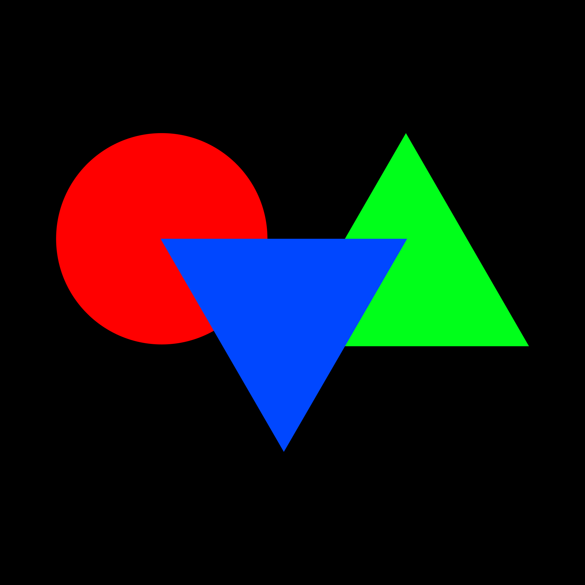

# Craft Class Variance Authority

Class Variance Authority plugin for CraftCMS.

## Requirements

This plugin requires Craft CMS 4.8.0 or later, and PHP 8.1.0 or later.

## Installation

You can install this plugin from the Plugin Store or with Composer.

#### From the Plugin Store

Go to the Plugin Store in your project’s Control Panel and search for “cva”. Then press “Install”.

#### With Composer

Open your terminal and run the following commands:

```bash
# go to the project directory
cd /path/to/my-project.test

# tell Composer to load the plugin
composer require wrux/craft-cva

# tell Craft to install the plugin
./craft plugin/install craft-cva
```

## Usage

This plugin provides utility functions for generating HTML class names and component variants.

### CX

The `cx` function is a utility for generating class names. It's inspired by the [clsx](https://github.com/lukeed/clsx) JavaScript package.

```twig
{# Generate a single class name #}
{{ cx('text-red-500') }}
{# Output: `text-red-500` #}

{# Generate multiple class names #}
{{ cx('text-red-500', 'bg-blue-500') }}
{# Output: `text-red-500 bg-blue-500` #}

{# Generate class names based on a condition #}
{{ cx('text-red-500', 'bg-blue-500', { 'text-lg': true, 'text-sm': false }) }}
{# Output: `text-red-500 bg-blue-500 text-lg` #}
```

### CVA

The `cva` function is a utility for generating component variants. It's inspired by the [class-variance-authority](https://cva.style/) JavaScript package.

```twig
{# Create the component configuration #}


{# Generate various button variants #}

<button class="{{ button.generate() }}">
  Click me
</button>
{#
Output:
<button class="block outline-none bg-blue-500 text-white py-2 px-4 text-base">
  Click me
</button>
#}

<button class="{{ button.generate({ display: 'secondary' }) }}">
  Click me
</button>
{#
Output:
<button class="block outline-none bg-purple-500 text-white py-2 px-4 text-base">
  Click me
</button>
#}

<button class="{{ button.generate({ display: 'primary', size: 'large' }) }}">
  Click me
</button>
{#
Output:
<button class="block outline-none bg-blue-500 text-white py-3 p-6 text-lg">
  Click me
</button>
#}
```
